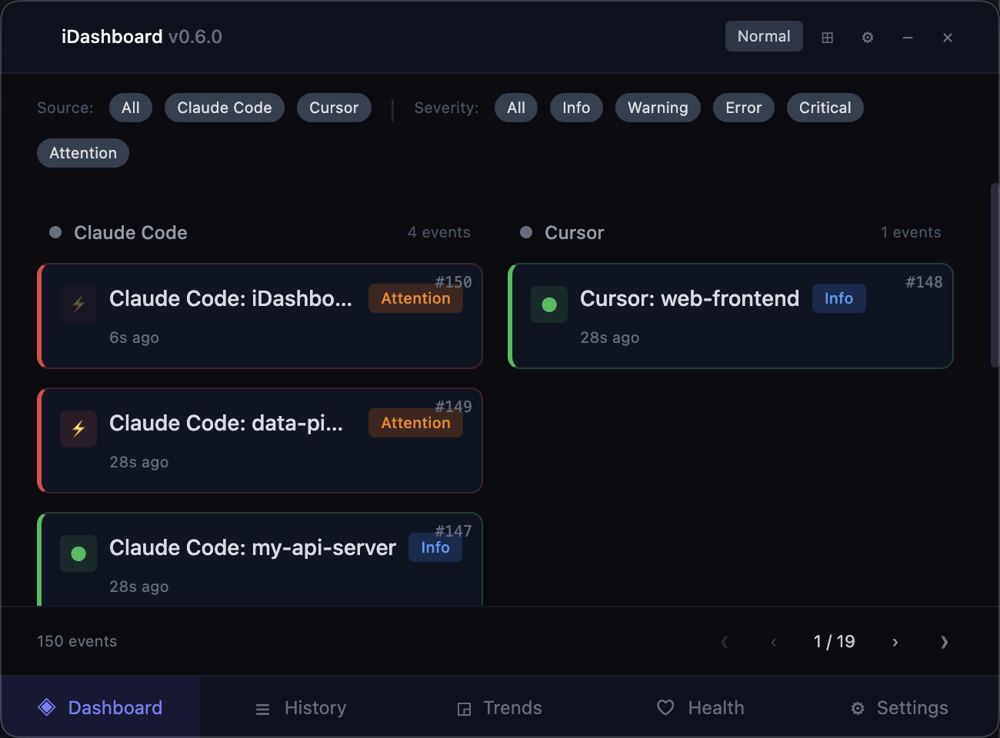
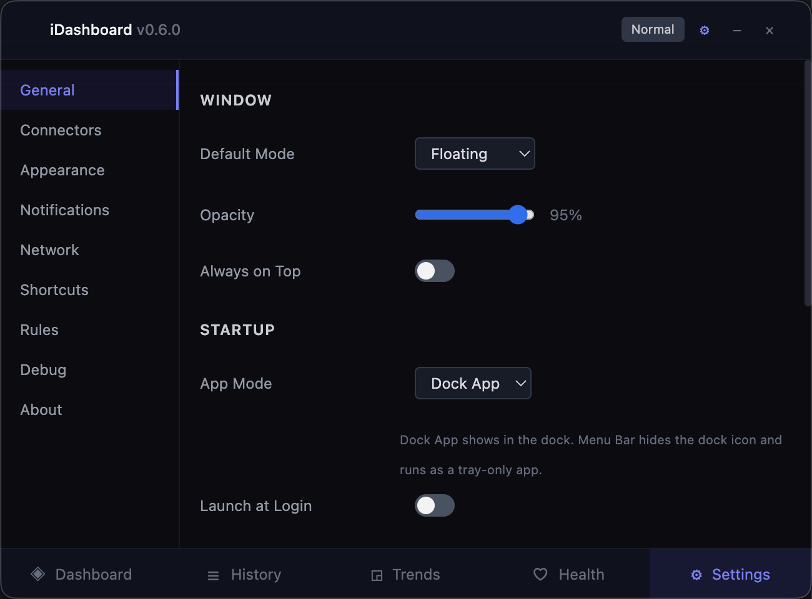
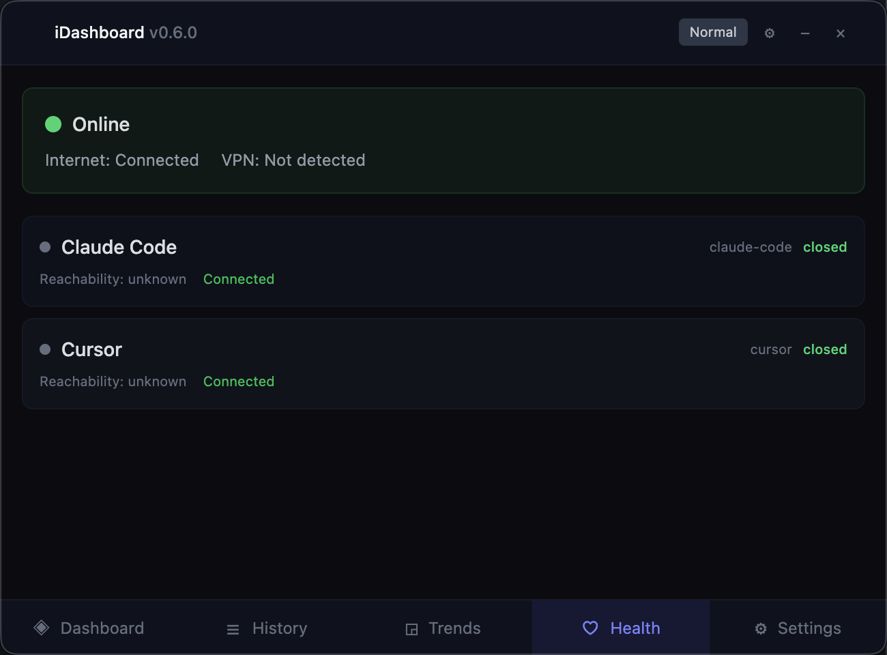

# iDashboard

A lightweight desktop dashboard for developer tool monitoring and attention routing. Aggregates events from AI coding assistants (Claude Code, Cursor), CI/CD pipelines, and other DevOps tools into a single glanceable window.



## Why

When running multiple AI agents, CI builds, or deploy pipelines, you lose track of which tool needs attention. iDashboard sits in a small always-on-top window and blinks when something requires your input — then lets you click to jump straight to the right terminal tab or editor window.

## Features

- **Push & pull connectors** — receive webhooks from tools like Claude Code and Cursor, or poll REST APIs like GitHub and TeamCity
- **Attention routing** — events surface with severity levels (`info`, `warning`, `error`, `critical`, `attention`) with blinking indicators for urgent items
- **One-click focus** — "Focus Terminal" jumps to the correct iTerm2 tab by session name; "Focus Editor" activates Cursor
- **Fluid responsive UI** — resize from a tiny 200px widget to full-screen; layout adapts automatically
- **Network health** — circuit breakers, VPN detection, per-connector reachability diagnostics
- **Event history** — SQLite-backed storage with configurable retention, deduplication, and export
- **YAML configuration** — all settings in `~/.idashboard/config.yaml`, connectors in `~/.idashboard/connectors/`

<details>
<summary>More screenshots</summary>

### Settings


### Health & Diagnostics


</details>

## Quick Start

### Prerequisites

- Node.js 20+
- macOS (primary target), Linux, or Windows

### Install & Run

```bash
git clone https://github.com/lukac-michal/iDashboard.git
cd iDashboard
npm install
npx electron-rebuild -f -w better-sqlite3   # rebuild native module for Electron
npm run dev                                   # start in dev mode
```

On first launch, default config files are created at `~/.idashboard/`.

### Build & Package

```bash
npm run build      # production build
npm run package    # create installer (DMG on macOS, AppImage on Linux)
```

## Connectors

### Currently Supported

| Connector | Type | Description |
|-----------|------|-------------|
| **Claude Code** | Push | Receives events via [Claude Code hooks](https://docs.anthropic.com/en/docs/claude-code/hooks) when the agent needs input or finishes a task |
| **Cursor** | Push | Receives events via [Cursor hooks](https://docs.cursor.com/context/hooks) on agent task completion |
| **GitHub** | Pull | Repository, PR, and issue monitoring |
| **TeamCity** | Pull | CI/CD build status |
| **Octopus Deploy** | Pull | Deployment and release monitoring |
| **Graylog** | Pull | Log aggregation alerts |
| **Slack** | Pull | Channel and mention monitoring |
| **Generic HTTP** | Pull | Poll any REST API |
| **Generic Push** | Push | Accept arbitrary events via HTTP POST |
| **Webhook** | Push | Built-in parsers for GitHub, GitLab, Bitbucket, PagerDuty |

### Setting Up Claude Code

Add hooks to `~/.claude/settings.json`:

```json
{
  "hooks": {
    "Notification": [
      {
        "hooks": [{
          "type": "command",
          "command": "curl -s -X POST http://localhost:19280/api/v1/events -H 'Content-Type: application/json' -d '{\"connector\": \"claude-code\", \"event\": \"needs-input\", \"session\": \"'$(basename $PWD)'\"}'",
          "async": true
        }]
      }
    ],
    "Stop": [
      {
        "hooks": [{
          "type": "command",
          "command": "curl -s -X POST http://localhost:19280/api/v1/events -H 'Content-Type: application/json' -d '{\"connector\": \"claude-code\", \"event\": \"task-complete\", \"session\": \"'$(basename $PWD)'\"}'",
          "async": true
        }]
      }
    ]
  }
}
```

When Claude Code finishes a task or needs input, iDashboard blinks and shows a "Focus Terminal" button that activates the correct iTerm2/Terminal tab.

### Setting Up Cursor

Add hooks to `~/.cursor/hooks.json`:

```json
{
  "hooks": {
    "stop": [{
      "command": "curl -s -X POST http://localhost:19280/api/v1/events -H 'Content-Type: application/json' -d '{\"connector\":\"cursor\",\"event\":\"task-complete\",\"session\":\"'$(basename $PWD)'\"}'",
      "type": "command",
      "blocking": false
    }]
  }
}
```

### Testing Manually

Send a test event to verify the setup:

```bash
curl -X POST http://localhost:19280/api/v1/events \
  -H 'Content-Type: application/json' \
  -d '{"connector":"claude-code","event":"task-complete","session":"my-project"}'
```

## Configuration

All configuration lives in `~/.idashboard/`:

```
~/.idashboard/
  config.yaml              # main app config (window, API, notifications, network)
  connectors/
    claude-code.yaml       # Claude Code connector config
    cursor.yaml            # Cursor IDE connector config
    github.yaml            # GitHub connector config (needs API token)
    ...
```

### Key Config Options

| Setting | Default | Description |
|---------|---------|-------------|
| `window.defaultMode` | `floating` | `floating`, `docked`, `tray`, or `fullscreen` |
| `window.opacity` | `0.95` | Window transparency (0.0 - 1.0) |
| `window.alwaysOnTop.onNotification.enabled` | `true` | Auto-surface on important events |
| `window.alwaysOnTop.onNotification.durationSec` | `30` | How long to stay on top |
| `api.port` | `19280` | Local HTTP API port |
| `notifications.blinkMinSeverity` | `info` | Minimum severity to trigger blink |
| `events.maxHistory` | `1000` | Max events kept in memory |
| `storage.retentionDays` | `30` | SQLite event retention |

## Local API

Base URL: `http://localhost:19280/api/v1`

| Endpoint | Method | Description |
|----------|--------|-------------|
| `/events` | `POST` | Push an event from an external tool |
| `/events` | `GET` | List active events |
| `/events/history` | `GET` | Query historical events |
| `/connectors` | `GET` | Connector status and health |
| `/agents` | `GET` | List registered agents |
| `/agents/spawn` | `POST` | Spawn a new agent |
| `/agents/:id` | `DELETE` | Remove an agent |
| `/agent-report` | `POST` | Agent status report |
| `/tasks` | `GET/POST` | List or create tasks |
| `/tasks/:id` | `GET/PATCH` | Get or update a task |
| `/messages` | `GET/POST` | List or send messages |

### Event Schema

```json
{
  "connector": "claude-code",
  "event": "needs-input",
  "session": "my-project",
  "message": "Choose option A or B",
  "severity": "attention"
}
```

Supported `event` types: `needs-input`, `task-complete`, or any custom string.
Supported `severity` levels: `info`, `warning`, `error`, `critical`, `attention`.

## Multi-Agent Orchestration (Experimental)

iDashboard can coordinate a team of Claude Code agents working in parallel iTerm2 tabs. Enable via **Settings > Experimental**.

### How It Works

```
┌─────────────────────────────────────────────────┐
│  iDashboard (System-level orchestration)         │
│  • Spawns agents in iTerm2 tabs                  │
│  • Routes tasks and messages between agents      │
│  • Persists state in SQLite (survives restarts)  │
│  • Visual dashboard with real-time status        │
│                                                   │
│  ┌──────────────┐  ┌──────────────┐              │
│  │ ProjectManager│  │  Architect   │              │
│  │ (delegates)   │  │  (designs)   │              │
│  └──────────────┘  └──────────────┘              │
│  ┌──────────────┐  ┌──────────────┐              │
│  │ Implementer  │  │  Reviewer    │              │
│  │ (builds)     │  │  (reviews)   │              │
│  └──────────────┘  └──────────────┘              │
│                                                   │
│  All agents communicate via REST API              │
│  (report status, create tasks, send messages)     │
└─────────────────────────────────────────────────┘
```

### Quick Start: Spawn a Team

1. Enable experimental mode in Settings
2. A **ProjectManager** agent auto-spawns
3. Spawn specialists from the Orchestrator tab (Architect, Implementer, Reviewer)
4. Create a task assigned to ProjectManager — it delegates sub-tasks to the team

### Agent REST API

Agents communicate via `http://localhost:19280/api/v1`:

```bash
# Spawn an agent
curl -X POST localhost:19280/api/v1/agents/spawn \
  -H 'Content-Type: application/json' \
  -d '{"name":"Architect","profilePath":"~/.idashboard/profiles/architect.md"}'

# Create a task assigned to an agent (auto-dispatched to their terminal)
curl -X POST localhost:19280/api/v1/tasks \
  -H 'Content-Type: application/json' \
  -d '{"title":"Design the auth system","createdBy":"user","assignTo":"Architect"}'

# Agent reports status
curl -X POST localhost:19280/api/v1/agent-report \
  -H 'Content-Type: application/json' \
  -d '{"agentName":"Architect","status":"done","shortSummary":"Auth design complete"}'

# Send message between agents
curl -X POST localhost:19280/api/v1/messages \
  -H 'Content-Type: application/json' \
  -d '{"from":"Architect","to":"Implementer","body":"Design doc ready, start building"}'
```

### MCP Server (Claude Code Integration)

An MCP server exposes iDashboard tools natively to Claude Code agents, replacing curl-based reporting.

```bash
npm run build:mcp   # Build the MCP server
```

Register in `~/.claude/settings.json`:
```json
{
  "mcpServers": {
    "idashboard": {
      "command": "node",
      "args": ["<path>/dist/mcp-server.js"],
      "env": { "IDASHBOARD_URL": "http://localhost:19280" }
    }
  }
}
```

Tools available: `report_status`, `list_agents`, `create_task`, `claim_task`, `complete_task`, `get_tasks`, `send_message`.

### Agent Profiles

17 profiles in `~/.idashboard/profiles/`:

| Profile | Role |
|---------|------|
| `project-manager.md` | Coordinates team, delegates tasks via REST API |
| `architect.md` | System design and technology decisions |
| `implementer.md` | Writes code and implements features |
| `reviewer.md` | Code review and quality checks |
| `skeptic.md` | Challenges assumptions, finds edge cases |
| `technical-writer.md` | Documentation updates |
| `security-auditor.md` | Security vulnerability detection |
| `performance-analyst.md` | Performance analysis |

## Development

```bash
npm run dev          # dev mode with hot reload
npm run build:mcp    # build standalone MCP server
npm test             # run unit tests (320+ tests)
npm run test:watch   # watch mode
npm run lint         # ESLint
npm run typecheck    # TypeScript check
```

### Tech Stack

- **Electron 34** + **Electron Vite** — desktop shell and fast builds
- **React 19** + **Zustand** — UI and state management
- **Tailwind CSS 4** — styling
- **Fastify 5** — local HTTP API server
- **Better SQLite 3** + **Drizzle ORM** — event, agent, task, and message storage
- **node-pty** — cross-platform PTY for terminal agent I/O
- **@modelcontextprotocol/sdk** — MCP server for Claude Code tool integration
- **Vitest** — 320+ unit tests

### Project Structure

```
src/
  main/           # Electron main process
    api/          # Fastify REST API (port 19280)
    connectors/   # Connector implementations (claude-code, cursor, github, etc.)
    db/           # Drizzle ORM schema (events, agents, tasks, messages)
    mcp/          # MCP server for Claude Code integration
    services/     # AgentRegistry, AgentLifecycle, TaskManager, MasterAgent, etc.
    ipc/          # IPC channel handlers
  renderer/       # React frontend
    components/   # UI components (dashboard, orchestrator, settings panels)
    store/        # Zustand state stores
    hooks/        # Custom React hooks
  shared/         # Types, constants, IPC channel definitions
  preload/        # Electron preload bridge
resources/
  profiles/       # 17 agent role profiles (project-manager, architect, etc.)
  preambles/      # Agent preamble with REST API instructions
```

## License

MIT
