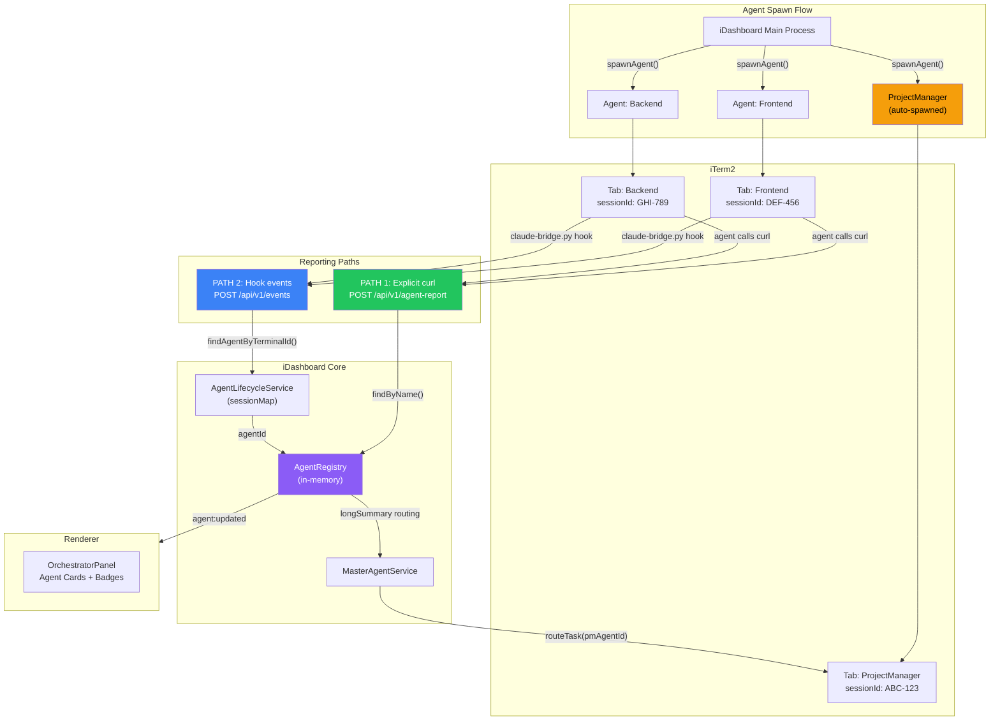
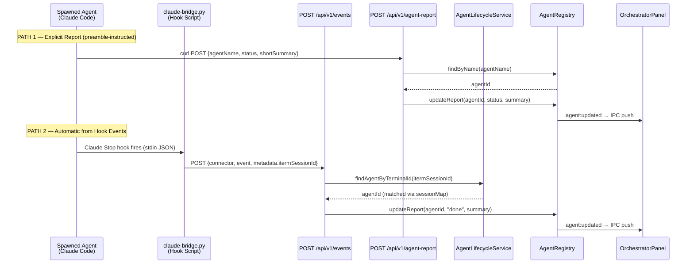
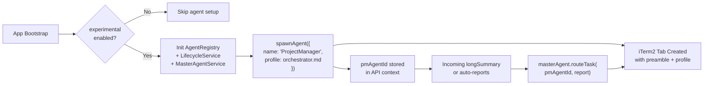
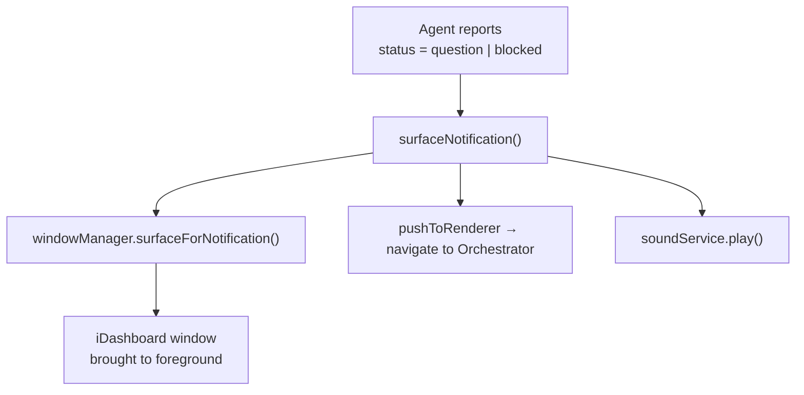
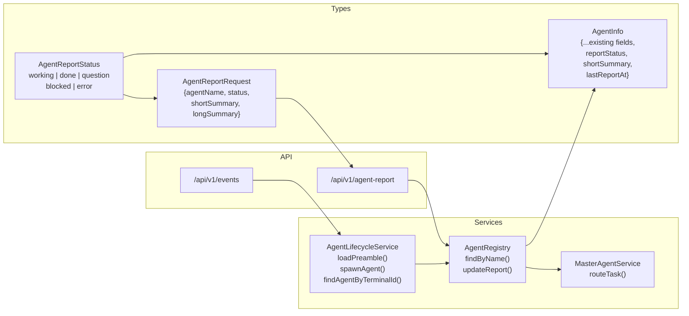
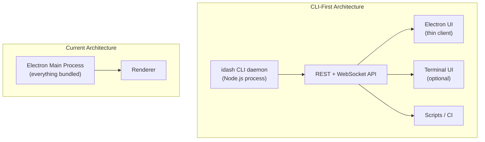

# Agent Reporting Protocol & PM Auto-Spawn — Architecture

## Overview

iDashboard's agent orchestration system spawns Claude Code instances in iTerm2 tabs and monitors their progress through two complementary reporting paths. A Project Manager agent auto-spawns on startup to receive detailed reports from all other agents.

> **Note:** All agent features are gated behind `config.experimental.enabled = true` in Settings > Experimental.

---

## System Architecture



---

## Dual Reporting Paths

The system uses two independent paths to track agent status. This redundancy ensures visibility even if an agent doesn't follow the preamble instructions.



### Path 1: Explicit Report (Agent-Driven)

The agent's preamble instructs it to POST status reports via `curl`:

```
POST http://127.0.0.1:{PORT}/api/v1/agent-report
Content-Type: application/json

{
  "agentName": "Frontend",
  "status": "working",
  "shortSummary": "Building login page",
  "longSummary": "Implemented form validation, OAuth buttons..."
}
```

**Advantages:** Agent controls timing and content. `longSummary` gets routed to PM.
**Limitation:** Relies on the agent actually executing the curl command.

### Path 2: Automatic Hook Events (System-Driven)

Claude Code's hook system (`~/.claude/settings.json`) fires for ALL Claude instances. The `claude-bridge.py` script captures these and POSTs to `/api/v1/events` with the `ITERM_SESSION_ID` environment variable in metadata.

The main process matches the session ID to a spawned agent:

```
ITERM_SESSION_ID = "w0t3p0:ABC-DEF-123"
                          └─── GUID ───┘
                                ↓
sessionMap: { "agent-001" → { sessionId: "ABC-DEF-123" } }
                                ↓
                         Match found → auto-update
```

**Event-to-Status Mapping:**

| Hook Event | Report Status | Summary |
|---|---|---|
| `needs-input` / `notification` | `question` | "Waiting for input" |
| `output-stop` / `stop` | `done` | First 120 chars of output |
| `output-subagent-stop` | `working` | "Subagent finished" |
| `output-tool-use` | `working` | "Using {toolName}" |
| `user-prompt` | `working` | "Received new prompt" |

**Advantages:** Zero-effort, always works, real-time.
**Limitation:** Summary text is generic (inferred, not authored by agent).

---

## PM Agent Auto-Spawn



The ProjectManager agent:
- Auto-spawns on app startup (if experimental mode is on)
- Receives the preamble + the `orchestrator.md` profile
- Gets `longSummary` reports from other agents via `masterAgent.routeTask()`
- Gets auto-reports when agents finish work (status=`done`)

---

## Notification Flow



When any agent reports `question` or `blocked` (via either path), the app:
1. Brings the window to the foreground
2. Navigates to the Orchestrator panel
3. Plays the notification sound

---

## Agent Card UI

Each agent card in the Orchestrator shows:

```
┌──────────────────────────┐
│ ● Frontend               │  ← connection status dot (green/yellow/red/gray)
│ online  [working]        │  ← AgentStatus + AgentReportStatus badge
│ Building login page      │  ← shortSummary (truncated)
│ 12s ago                  │  ← time since last report
└──────────────────────────┘
```

**Report Status Badge Colors:**

| Status | Color | Meaning |
|---|---|---|
| `working` | Green | Actively making progress |
| `done` | Dark green | Task completed |
| `question` | Yellow | Needs human input |
| `blocked` | Red | Cannot proceed |
| `error` | Dark red | Hit an error |

---

## Data Flow Summary



---

## Key Files

| File | Role |
|---|---|
| `src/shared/types.ts` | `AgentReportStatus`, `AgentReportRequest`, extended `AgentInfo` |
| `src/main/services/agent-registry.ts` | `findByName()`, `updateReport()` |
| `src/main/services/agent-lifecycle.ts` | `loadPreamble()`, `findAgentByTerminalId()`, `apiPort` |
| `src/main/api/routes/agent-reports.ts` | `POST /api/v1/agent-report` route |
| `src/main/api/server.ts` | Extended `APIContext` with agent fields |
| `src/main/index.ts` | Auto-update matching, PM spawn, `setupDefaultPreambles()` |
| `src/renderer/components/panels/OrchestratorPanel.tsx` | Report status badges, shortSummary display |
| `resources/preambles/agent-preamble.md` | Preamble template with `{{AGENT_NAME}}` / `{{PORT}}` |
| `resources/hooks/claude-bridge.py` | Hook script sending `itermSessionId` metadata |

---

## Future Consideration: CLI-First Architecture

The current implementation is tightly coupled to the Electron app's main process. A CLI-first approach would:

- Extract `AgentRegistry`, `AgentLifecycleService`, and the reporting API into a standalone daemon
- Let the Electron UI be a thin client connecting via WebSocket
- Enable headless operation, scripting, and CI/CD integration
- Make testing and development faster (no Electron rebuild cycle)



This would decouple the agent orchestration logic from the UI framework, making each layer independently testable and deployable.
